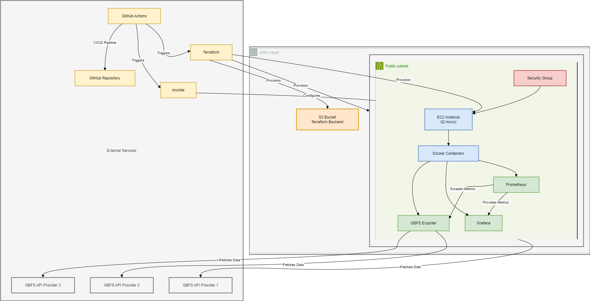

# GBFS Monitoring Stack Deployment

## Table of Contents

- [Introduction](#introduction)
- [Overview of the Setup](#overview-of-the-setup)
- [Infrastructure Choices](#infrastructure-choices)
- [Running the Project](#running-the-project)
    - [Local Testing with Docker Compose](#local-setup-using-docker-compose)
    - [AWS Deployment](#deploying-to-aws)
- [CI/CD Pipelines](#cicd-pipeline)

---

## Introduction

Welcome to the **GBFS (General Bikeshare Feed Specification) Monitoring Stack Deployment** project. This setup automates
the provisioning of infrastructure and the deployment of a comprehensive monitoring stack tailored for GBFS data. The
monitoring stack comprises Prometheus for metrics collection, Grafana for visualization, and a custom Prometheus
exporter for fetching and exposing GBFS metrics.

### Tools Used

- **Prometheus**: For metrics collection and monitoring.
- **Grafana**: For visualizing metrics through dashboards.
- **Custom Prometheus Exporter**: For exporting GBFS data into a Prometheus-friendly format.
- **Terraform**: For infrastructure provisioning on AWS.
- **Ansible**: For configuration management and application deployment.
- **GitHub Actions**: For automating the CI/CD pipeline.

### Why These Tools?

- **Prometheus** and **Grafana** are industry-standard tools for monitoring and visualization, providing comprehensive
  insights into system performance.
- The **Custom Prometheus Exporter** bridges the gap between GBFS data and Prometheus, enabling effective monitoring of
  bikeshare feeds.
- **Terraform** provides a robust way to define and manage cloud infrastructure as code, ensuring consistency and
  repeatability.
- **Ansible** offers straightforward automation for configuring servers and deploying applications, making it ideal for
  managing the monitoring stack.
- **GitHub Actions** seamlessly integrates with the repository, allowing for automated workflows that handle both
  provisioning and deployment.

For more details on the Prometheus exporter, please refer to the [Prometheus Exporter README](./exporter/README.md).

---

### **Overview of the Setup**

This setup integrates several tools to enable real-time monitoring and visualization of bike-sharing data
across multiple providers. It combines **Prometheus** and **Grafana** for monitoring and visualization, a **custom GBFS
Prometheus Exporter** for data collection, and uses **Terraform** and **Ansible** for infrastructure provisioning and
deployment. Additionally, the entire process is streamlined using **GitHub Actions** for CI/CD.

#### **Prometheus & Grafana**:

- **Prometheus** is the backbone of this setup, responsible for scraping, storing, and managing the time-series metrics.
  It scrapes data from the custom-built [GBFS Prometheus exporter](./exporter/README.md), and stores it for long-term
  analysis. The scraped metrics are exposed via Prometheus’s own HTTP endpoint, making them easy to query for analytics
  and monitoring.
- **Grafana** acts as the visualization layer. It connects to Prometheus to pull the stored metrics and displays them in
  rich, interactive dashboards. For this setup, a pre-configured Grafana dashboard is provided to offer insights into
  key bike-sharing metrics such as available bikes, docks, and station statuses across different providers.

#### **Custom GBFS Prometheus Exporter**:

- The **GBFS Prometheus Exporter** is a custom-built tool that collects data from various General Bikeshare Feed
  Specification (GBFS) API providers. The exporter is responsible for querying the GBFS APIs in real time, processing
  the data, and exposing it as metrics for Prometheus to scrape. The exporter supports multiple providers, making it a
  versatile solution for monitoring bike-sharing services in different cities.
- The exporter runs as a Docker container, and its configuration (including the providers to monitor) is managed via a
  simple [providers.yaml](./exporter/configs/providers.yaml) file. The exporter exposes the metrics on port `8000` for
  Prometheus to scrape.

#### **Terraform & Ansible**:

- **Terraform** is used to provision the infrastructure needed for this setup on AWS. It automates the creation of an
  EC2 instance, a VPC, security groups, and other necessary resources. The Terraform configuration also sets up the
  backend for storing the state files in an S3 bucket. This ensures that infrastructure is reproducible, scalable, and
  maintainable.
- **Ansible** is used for the deployment of the monitoring stack onto the EC2 instance. It installs Docker, configures
  Docker Compose, and deploys the GBFS exporter, Prometheus, and Grafana. Ansible handles all the provisioning of
  software dependencies and the configuration of services, ensuring a consistent deployment process.

#### **GitHub Actions**:

- The CI/CD pipeline is fully automated using **GitHub Actions**. When a change is pushed to the repository, the
  pipeline can provision the infrastructure using Terraform, then deploy the monitoring stack using Ansible. The
  pipeline includes manual approval steps for applying infrastructure changes, ensuring that infrastructure
  modifications are reviewed before they are applied. Environment variables and secrets such as SSH keys are securely
  managed through GitHub Secrets.
- Additionally, the pipeline automatically builds and pushes the Docker image of the GBFS Prometheus exporter to a
  container registry whenever changes are made to the exporter. This ensures the latest version of the exporter is
  always ready to be deployed.
- GitHub Actions also ensure that the infrastructure and deployment are kept up to date, making the entire process of
  deploying and maintaining the monitoring stack seamless and automated.


---

### **Infrastructure Choices**

For this project, I chose **Prometheus**, **Grafana**, and a **custom Prometheus exporter** for data monitoring and
visualization, as well as **Terraform** and **Ansible** for infrastructure provisioning and deployment. Below is an
explanation of why these tools were selected, drawing from both personal experience and best practices for scalability
and simplicity.

#### **Prometheus, Grafana, and Custom Exporter**:

- **Prometheus** was chosen as the core monitoring tool because of its powerful and reliable metrics collection
  capabilities. It is widely used in the industry and excels at scraping time-series data, making it ideal for real-time
  monitoring of GBFS data. I've worked with Prometheus extensively in my current role, and it's proven to be highly
  scalable, well-documented, and backed by a strong community.

- **Grafana** was chosen for visualization due to its ease of use, rich dashboarding capabilities, and seamless
  integration with Prometheus. In my current role, I use Grafana regularly for visualizing key metrics, and it is an
  industry standard for observability and monitoring. Grafana allows for customizable, interactive dashboards, making it
  an obvious choice for presenting the bike-sharing metrics in an accessible format.

- **Custom Prometheus Exporter**: I chose to build a custom Prometheus exporter for GBFS data because of my extensive
  experience in building exporters for Prometheus. I've created multiple exporters in the past, including one for
  [Logstash](https://github.com/B3ns44d/prom-logstash-exporter), which is publicly available. Given this familiarity,
  building a custom exporter was a natural choice for me.
  This also allowed me to tailor the exporter specifically for the GBFS APIs, ensuring that it accurately captures bike
  availability, dock status, and other relevant metrics. A custom exporter also provides flexibility and performance
  optimizations specific to the task at hand.

- **Solid Stack**: Prometheus and Grafana form a solid, well-tested monitoring stack that is commonly used in real-world
  infrastructures. By building this setup, I was able to showcase not only my experience with the tools but also the
  scalability and flexibility of the solution.

#### **Terraform and Ansible**:

- **Terraform** was selected for provisioning the AWS infrastructure because of its declarative syntax, enabling
  infrastructure-as-code (IaC) principles. Terraform ensures that the infrastructure setup is reproducible and
  version-controlled. Since I needed to provision an EC2 instance, VPC, and security groups, Terraform was a perfect fit
  for managing this infrastructure. I also used Terraform to store state files in an S3 bucket, ensuring a scalable and
  reliable state management solution.

- **Ansible** was chosen for the deployment process because, when dealing with EC2 instances, it simplifies the
  management of software provisioning and configuration. Ansible allowed me to install Docker, deploy the monitoring
  stack, and configure services in a way that was easier to manage than trying to do everything through Terraform. Since
  Ansible excels at managing server configurations, it was a better choice for deploying the stack to a single EC2
  instance, providing more flexibility than managing these tasks through Terraform alone.

- **Why EC2 instead of Kubernetes?** I chose **EC2** for this deployment mainly because it is part of AWS’s free tier,
  making it cost-effective. However, if I had more resources, I would have used a **Kubernetes (K8s) cluster** instead,
  as it would allow for easier scaling and service orchestration. I typically use Kubernetes for containerized
  applications in production environments, and with more time or budget, I would have used Terraform to manage the
  entire infrastructure, including the Kubernetes setup. In this case, I opted for EC2 to keep costs low, while still
  showcasing a scalable and professional setup.

#### **Scalability and Real-World Infrastructure**:

This setup may appear as an overkill for a relatively small task like collecting GBFS data, but my goal was to design it
with **scalability** and **real-world infrastructure** in mind. By building the project with Prometheus, Grafana,
Terraform, and Ansible, I’m demonstrating how the solution can easily scale if more GBFS providers or different services
need to be monitored.

Additionally, I wanted to showcase how I would approach such a task in a **production-grade environment**, using tools
that I’ve used extensively in professional settings. This includes:

- Using Terraform for infrastructure as code, ensuring everything is reproducible and manageable.
- Deploying a real-time monitoring stack with Prometheus and Grafana to show that the setup can handle scaling up
  metrics.
- Leveraging Ansible to automate the provisioning and configuration of a VM instance in a way that mirrors how EC2
  instances are handled in real-world scenarios.

Even though this setup may seem extensive for this particular task, it’s designed to handle future expansions and
demonstrates modern DevOps practices in action.

---

Here’s the updated **Running the Project** section for the README file:

---

### **Running the Project**

You can run this project in two ways: either **locally using Docker Compose** for quick testing or **deploy it to AWS**
for a scalable, cloud-based solution. Below are step-by-step instructions for both setups, along with their
prerequisites.

#### **Prerequisites**

- **Docker**: Required for local testing with Docker Compose.
- **AWS Account**: Required if you wish to deploy the project to AWS using Terraform and Ansible.
- **Terraform**: Used for provisioning infrastructure in AWS.
- **Ansible**: Used for deploying Prometheus, Grafana, and the GBFS Exporter on AWS EC2 instances.
- **GitHub Actions**: Used for the CI/CD pipeline to automate deployment and testing.

### **Local Setup Using Docker Compose**

You can run the GBFS Monitoring Stack locally using Docker Compose. This method is useful for quick testing and
development.

#### **Steps for Local Setup**:

1. **Clone the Repository**:

   ```bash
   git clone https://github.com/B3ns44d/gbfs-monitoring-stack.git
   cd gbfs-monitoring-stack
   ```

2. **Create a `.env` file** (use the example file to set environment variables):

   ```bash
   cp .env.example .env
   ```

   Edit the `.env` file and add your Grafana credentials (admin user and password).

3. **Run Docker Compose**:

   Use the following command to start the GBFS Exporter, Prometheus, and Grafana:

   ```bash
   docker compose --env-file .env up -d
   ```

   This will start all services in the stack:

- **GBFS Exporter** (running on port 8000)
- **Prometheus** (running on port 9090)
- **Grafana** (running on port 3000)

4. **Access the Services**:

- **Prometheus**: Visit `http://localhost:9090` to access Prometheus.
- **Grafana**: Visit `http://localhost:3000` and log in using the credentials from the `.env` file.
- **GBFS Exporter Metrics**: Visit `http://localhost:8000/metrics` to see the GBFS metrics exposed by the exporter.

### **Deploying to AWS**

To deploy the monitoring stack on AWS, you'll use **Terraform** for infrastructure provisioning and **Ansible** for
deployment.

#### **Steps for AWS Deployment**:

1. **Clone the Repository**:

   ```bash
   git clone https://github.com/B3ns44d/gbfs-monitoring-stack.git
   cd gbfs-monitoring-stack
   ```

2. **Set up AWS Credentials**:

   Ensure that your AWS credentials are properly configured on your machine. You can do this by setting up an AWS
   profile or exporting your credentials.

   ```bash
   export AWS_ACCESS_KEY_ID=<your-access-key>
   export AWS_SECRET_ACCESS_KEY=<your-secret-key>
   epxort AWS_DEFAULT_REGION=<your-region>
   ```

3. **Provision the Infrastructure with Terraform**:

   Before you start, ensure that Terraform is installed on your machine. Navigate to the `infra` folder and run the
   following commands:

   ```bash
   cd infra
   export TF_VAR_key_pair=<your-ssh-key-name>
   terraform init -backend-config="bucket=<your-s3-bucket-name>" -backend-config="region=<your-s3-bucket-region>"
   terraform plan -out="plan.tfplan"
   terraform apply "plan.tfplan"
   
   # to get the public IP of the EC2 instance
   EC2_PUBLIC_IP=$(terraform output -raw ec2_public_ip)
   ```

   This will provision the following resources in AWS:

- An EC2 instance
- A VPC with the necessary networking setup
- Security groups to allow traffic on necessary ports (8000 for GBFS Exporter, 9090 for Prometheus, and 3000 for
  Grafana)

4. **Deploy the Monitoring Stack with Ansible**:

   Once the infrastructure is provisioned, use Ansible to deploy Prometheus, Grafana, and the GBFS Exporter to the EC2
   instance.

   First, create an inventory file for Ansible that contains the public IP of the EC2 instance, Note you will need to
   manually create the key pair in the AWS console and provide the path to the private key file in the

   ```bash
   echo "[gbfs]" > inventory.ini
   echo "gbfs-instance ansible_host=<EC2_PUBLIC_IP> ansible_user=ec2-user ansible_ssh_private_key_file=<path-to-your-ssh-key> ansible_ssh_common_args='-o StrictHostKeyChecking=no'" >> inventory.ini
   ```

   Then, run the Ansible playbook:

   ```bash
   ansible-playbook infra/deployment/playbooks/gbfs.yaml -i inventory.ini
   ```

5. **Access the Services**:

- **Prometheus**: Visit `http://<EC2_PUBLIC_IP>:9090` to access Prometheus.
- **Grafana**: Visit `http://<EC2_PUBLIC_IP>:3000` to access Grafana.
- **GBFS Exporter Metrics**: Visit `http://<EC2_PUBLIC_IP>:8000/metrics` to see the GBFS metrics exposed by the
  exporter.

### **CI/CD Pipeline**

The CI/CD pipeline is integrated with GitHub Actions and automates both the provisioning of AWS infrastructure and the
deployment of the monitoring stack. The pipeline also builds the Docker image for the exporter and runs tests before
pushing the image to the GitHub Container Registry.

- **Provisioning**: Terraform is used to provision the AWS resources, and the GitHub Action ensures that the
  infrastructure is only applied after the user approves the plan.
- **Deployment**: Once the infrastructure is ready, Ansible is used to deploy the Prometheus, Grafana, and GBFS Exporter
  components.
- **Docker Image**: The exporter image is built and pushed to the GitHub Container Registry, and tests are run before
  deployment.

### Workflow Overview

0. **CI: Build and Push Docker Image**:
    - **Job**: `build-and-push`
    - **Actions**:
        - Checkout repository.
        - Build Docker image.
        - Run tests.
        - Push Docker image to GitHub Container Registry.

1. **Provision Infrastructure**:
    - **Job**: `provision-infrastructure`
    - **Actions**:
        - Checkout repository.
        - Set up Terraform.
        - Initialize Terraform with backend configuration.
        - Plan Terraform changes.
        - Upload Terraform plan as an artifact.

2. **Apply Terraform Plan**:
    - **Job**: `apply-terraform`
    - **Depends On**: `provision-infrastructure`
    - **Environment**: `dev` (requires manual approval)
    - **Actions**:
        - Checkout repository.
        - Set up Terraform.
        - Download Terraform plan artifact.
        - Apply Terraform plan.
        - Retrieve EC2 instance public IP.

3. **Deploy Monitoring Stack**:
    - **Job**: `deploy-stack`
    - **Depends On**: `apply-terraform`
    - **Actions**:
        - Checkout repository.
        - Install Ansible.
        - Create SSH key file from GitHub secret.
        - Generate Ansible `inventory.ini` with EC2 public IP.
        - Run Ansible playbook to deploy Prometheus, Grafana, and Exporter.

For any changes to the `exporter` files, the CI pipeline automatically triggers the build and deployment processes.
