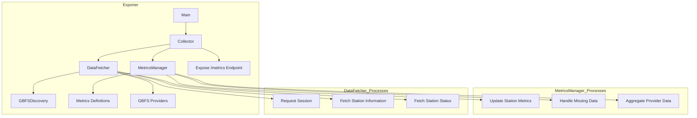

# GBFS Prometheus Exporter

## Table of Contents

- [Overview](#overview)
- [Features](#features)
- [Architecture](#architecture)
- [Prerequisites](#prerequisites)
- [Installation](#installation)
    - [Using Docker](#using-docker)
    - [Manual Installation](#manual-installation)
- [Configuration](#configuration)
    - [Configuration File (`providers.yaml`)](#configuration-file-providersyaml)
- [Usage](#usage)
    - [Command-Line Arguments](#command-line-arguments)
    - [Running the Exporter](#running-the-exporter)
- [Metrics](#metrics)
    - [Metric List](#metric-list)

## Overview

The **GBFS Prometheus Exporter** is a tool designed to collect and expose metrics from GBFS (General Bikeshare Feed
Specification) providers for monitoring purposes. This src fetches real-time data from multiple bike-sharing
systems, processes the information, and makes it available as Prometheus metrics, enabling comprehensive monitoring and
analysis of bike availability, station statuses, and system performance.

## Features

- **Multi-Provider Support**: Collects data from multiple GBFS-compliant bike-sharing providers.
- **Configurable Setup**: Specify configuration files and ports via command-line arguments.
- **Prometheus Integration**: Exposes metrics in a Prometheus-compatible format for seamless scraping.
- **Error Handling**: Gracefully handles missing feeds and other data inconsistencies.
- **Docker Support**: Easily deployable using Docker containers.
- **Extensible Architecture**: Modular design allows for easy extension and customization.

## Architecture

The src consists of several key components that work together to fetch data from GBFS providers, process it, and
expose it as Prometheus metrics.

### Detailed Exporter Architecture



### Flow Description

1. **GBFS Providers**: External bike-sharing systems that publish data (station information and status) via GBFS APIs.
2. **Exporter**: Fetches data from GBFS providers and exposes it as Prometheus metrics.
    - **Collector**: Orchestrates data fetching and metrics updating during each Prometheus scrape.
    - **DataFetcher**: Retrieves data from GBFS providers using their auto-discovery URLs.
    - **GBFSDiscovery**: Automatically discovers available feed URLs from each GBFS provider.
    - **MetricsManager**: Processes fetched data and updates Prometheus metrics.
    - **Metrics Definitions**: Defines the structure and labels of the Prometheus metrics.
    - **Expose /metrics Endpoint**: Makes the metrics available on an HTTP endpoint for Prometheus to scrape.

## Prerequisites

- **Python 3.10 or higher**
- **Docker** (optional, for containerized deployment)
- **Prometheus**: For scraping and storing metrics (setup in [Overall Stack Documentation](../README.md)).
- **Grafana**: For visualizing metrics (setup in [Overall Stack Documentation](../README.md)).

## Installation

You can install and run the GBFS Prometheus Exporter either manually or using Docker.

### Using Docker

1. **Build the Docker Image**

   Navigate to the root directory of the src and build the Docker image.

   ```bash
   docker build -t gbfs-src:latest .
   ```

2. **Run the Docker Container**

   ```bash
   docker run -d \
     -p 8000:8000 \
     -v /path/to/configs/providers.yaml:/src/src/configs/providers.yaml \
     --name gbfs-src \
     gbfs-src:latest \
     --config /src/src/configs/providers.yaml \
     --port 8000
   ```

    - Replace `/path/to/configs/providers.yaml` with the actual path to your `providers.yaml` file.
    - **Note**: Adjust the `--port` value if you wish to expose metrics on a different port.

### Manual Installation

1. **Clone the Repository**

   ```bash
   git clone https://github.com/B3ns44d/gbfs-monitoring-stack.git
   cd gbfs-monitoring-stack/src
   ```

2. **Create a Virtual Environment**

   ```bash
   python3 -m venv venv
   source venv/bin/activate
   ```

3. **Install Dependencies**

   ```bash
   pip install -r requirements.txt
   ```

4. **Configure Providers**

    - Edit the `configs/providers.yaml` file to include your GBFS providers.

5. **Run the Exporter**

   ```bash
   python main.py --config configs/providers.yaml --port 8000
   ```

    - **Arguments**:
        - `--config` or `-c`: Path to the configuration file (default: `configs/providers.yaml`)
        - `--port` or `-p`: Port to expose metrics on (default: `8000`)

## Configuration

### Configuration File (`providers.yaml`)

The `providers.yaml` file contains the list of GBFS providers from which the src will fetch data. Each provider
entry includes a name and an auto-discovery URL.

```yaml
# src/configs/providers.yaml

providers:
  - name: "Buenos Aires"
    auto_discovery_url: "https://buenosaires.publicbikesystem.net/ube/gbfs/v1/"
  - name: "Ecobici"
    auto_discovery_url: "https://ecobici.publicbikesystem.net/gbfs/gbfs.json"
  - name: "LINK Linz"
    auto_discovery_url: "https://mds.linkyour.city/gbfs/at_linz/gbfs.json"
```

#### Adding More Providers

To add more GBFS providers, simply append additional entries under the `providers` list.

```yaml
providers:
  - name: "New Provider"
    auto_discovery_url: "https://newprovider.example.com/gbfs/auto_discovery.json"
```

## Usage

### Command-Line Arguments

The src can be configured using command-line arguments to specify the configuration file path and the HTTP server
port.

- **`--config` or `-c`**: Path to the configuration file.
- **`--port` or `-p`**: Port to expose metrics on.

### Running the Exporter

#### Using Docker

```bash
docker run -d \
  -p 8000:8000 \
  -v /path/to/configs/providers.yaml:/src/src/configs/providers.yaml \
  --name gbfs-src \
  gbfs-src:latest \
  --config /src/src/configs/providers.yaml \
  --port 8000
```

- **Custom Configuration Path and Port**:

  To specify a custom configuration file path and port, adjust the `--config` and `--port` arguments accordingly.

  ```bash
  docker run -d \
    -p 9000:9000 \
    -v /custom/path/to/providers.yaml:/src/src/configs/providers.yaml \
    --name gbfs-src \
    gbfs-src:latest \
    --config /src/src/configs/providers.yaml \
    --port 9000
  ```

#### Manual Execution

```bash
source venv/bin/activate
python src/main.py --config configs/providers.yaml --port 8000
```

- **Using Shortened Flags**:

  ```bash
  python src/main.py -c configs/providers.yaml -p 8000
  ```

### Accessing Metrics

The src exposes metrics at `http://localhost:8000/metrics` by default. You can verify it by visiting the URL in
your browser or using `curl`:

```bash
curl http://localhost:8000/metrics
```

## Metrics

The src defines several Prometheus metrics to monitor various aspects of the bike-sharing systems.

### Metric List

Here are some of the key metrics exposed by the src:

- **Total Metrics per Provider**:
    - `gbfs_bikes_available_total`: Total number of bikes available.
    - `gbfs_docks_available_total`: Total number of docks available.
    - `gbfs_bikes_disabled_total`: Total number of disabled bikes.
    - `gbfs_docks_disabled_total`: Total number of disabled docks.
    - `gbfs_active_stations_total`: Total number of active stations.
    - `gbfs_stations_total`: Total number of stations.

- **Station-Level Metrics**:
    - `gbfs_bikes_available`: Number of bikes available at each station.
    - `gbfs_docks_available`: Number of docks available at each station.
    - `gbfs_bikes_disabled`: Number of disabled bikes at each station.
    - `gbfs_docks_disabled`: Number of disabled docks at each station.
    - `gbfs_station_capacity`: Capacity (number of docks) at each station.
    - `gbfs_station_is_installed`: Station installation status (1 = installed, 0 = not installed).
    - `gbfs_station_is_renting`: Station renting status (1 = renting, 0 = not renting).
    - `gbfs_station_is_returning`: Station returning status (1 = accepting returns, 0 = not accepting).

### Example Metrics Output

```plaintext
gbfs_bikes_available_total{provider="Buenos Aires"} 1000
gbfs_docks_available_total{provider="Buenos Aires"} 500
gbfs_bikes_available{provider="Buenos Aires",station_id="3",station_name="003 - ADUANA"} 28.0
gbfs_docks_available{provider="Buenos Aires",station_id="3",station_name="003 - ADUANA"} 72.0
...
```
